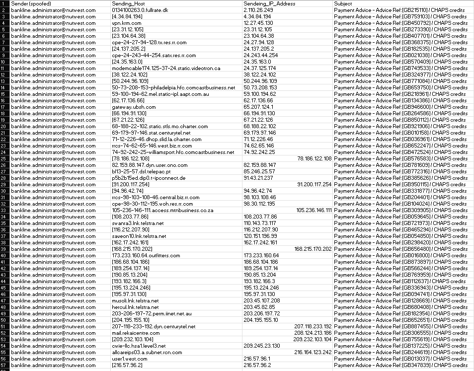
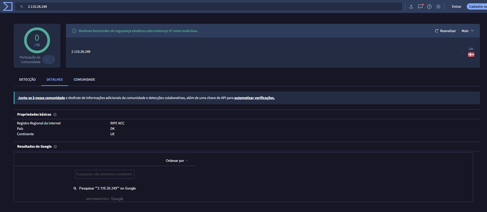
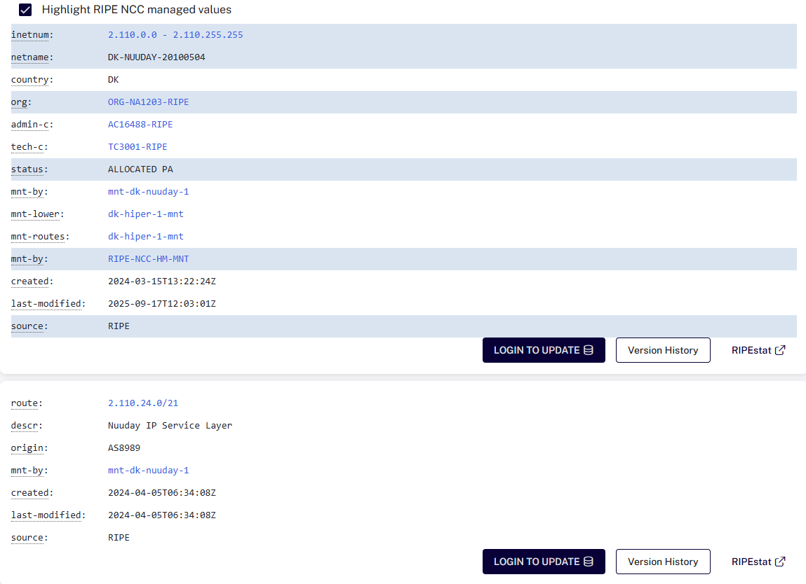

# Investigação de Phishing com Análise de PCAP

## Objetivo

O objetivo deste projeto é realizar a investigação de um incidente de phishing, identificando indicadores de comprometimento (IOCs) e investigando o tráfego de rede relacionado ao ataque.

Durante a investigação foram analisados remetentes spoofed, endereços IP, domínios, arquivos maliciosos e comunicações de rede presentes em uma captura PCAP.

A análise foi realizada utilizando ferramentas como Wireshark, VirusTotal e RIPE, além do mapeamento das evidências encontradas com o framework MITRE ATT&CK.

## Ferramentas utilizadas

- Wireshark
- VirusTotal
- RIPE Database
- MITRE ATT&CK
- Excel

## Fonte do laboratório

Os dados utilizados neste projeto foram obtidos a partir de um exercício disponibilizado pelo Malware-Traffic-Analysis.net, referente a um caso de phishing com entrega de malware Upatre/Dyre.

A análise foi realizada de forma defensiva, sem execução das amostras maliciosas.

## Análise inicial do phishing

A primeira etapa da investigação foi analisar os dados relacionados aos e-mails enviados durante o incidente.

O arquivo analisado apresentava informações sobre o remetente utilizado, hosts de envio, endereços IP e o assunto das mensagens.

Foi identificado o uso recorrente do remetente spoofed:

`bankline.administrator@nutwest.com`

Também foi possível observar diversos hosts e endereços IP diferentes utilizados para o envio das mensagens, enquanto o padrão do assunto permanecia semelhante:

`Payment Advice - Advice Ref:[...] / CHAPS credits`

A repetição do mesmo remetente e do mesmo padrão de assunto, combinada com diferentes hosts e endereços IP de origem, indicou uma campanha de envio em massa.

## Investigação do IP de envio

Durante a análise dos dados da campanha, o endereço IP `2.110.26.249` foi selecionado para enriquecimento e consulta em fontes de Threat Intelligence.

A primeira consulta foi realizada no VirusTotal.

Na consulta atual, nenhum dos mecanismos de segurança disponíveis no VirusTotal classificou o endereço como malicioso.

Como o incidente analisado ocorreu em 2015, a reputação atual do IP não foi utilizada como confirmação de que o endereço era legítimo ou malicioso na época da campanha.

Também foi realizada uma consulta no RIPE Database para obter informações sobre o bloco de rede associado ao endereço.

A consulta atual mostrou que o endereço pertence ao bloco 2.110.0.0 - 2.110.255.255, associado à Dinamarca, e que a rota observada possui origem no ASN AS8999.
